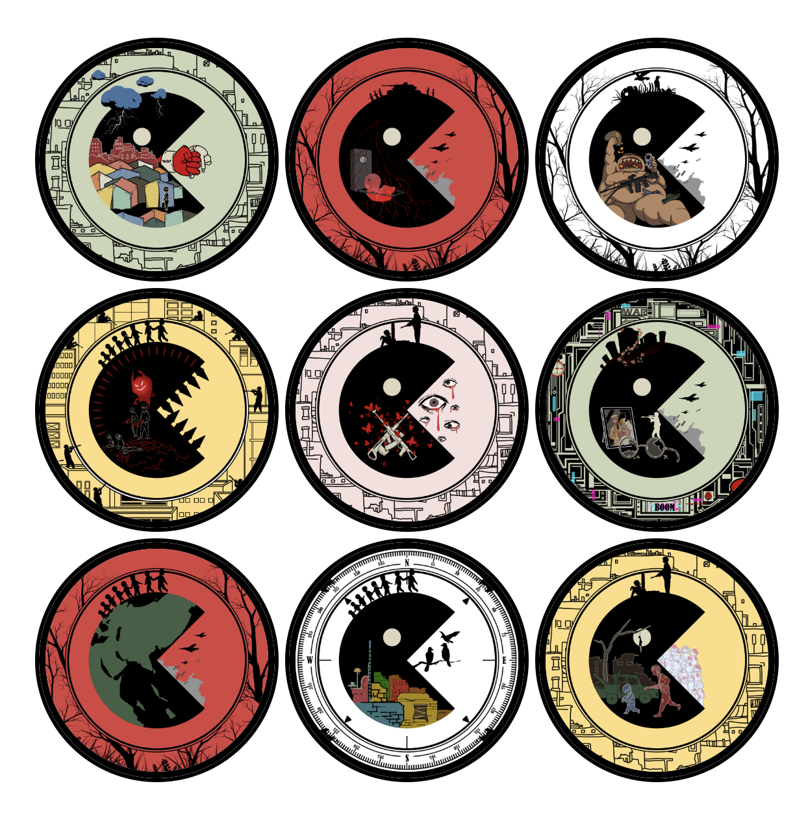

# ZERO SUM PACT

ZERO SUM PACT is a project that brings together art, history, and strategy into an collabratvie on-chain experience.

## Part 1 Overview. NFT Collection ZeroSumPac

Crafted by half-Japanese artist @K.Nami, this collection is an reflection on the long lasting scars of war. Each trait is carefuly crafted facet of 
war: shattered childhood, seperated family, inflation, greed and gluttony. 

Our design process began with the Shape Network's minimalistic black circle logo. After realizing it resembled a Pac-Man with a closed mouth, the concept evolved into a Pac-like figure, symbolizing the insatiable appetite for resources which is the root of conflicts.

## Part 2 Overview: On-Chain Strategy Game 

Inspired by the Go, Pac-Man, and Diplomacy, this is an original multi-player "board game" designed by @ubinhash, allowing hundreds of players to compete asynchronously. It puts up players in a battle for scarce resources. The decision to compete, or collaborate, is in the player's hand.

# GAMEPLAY EXPLAINED

We're building a browser-based collaborative strategy board game (ZeroSumPact), inspired by Go, Pacman and Dipomacy. Where hundred of player can compete in the same game asynchronously. We want this game to mimic a mini-society where resources act as a double-edged sword— it's is something that brings people together something that sparks conflict. 

The game is token-gated by our NFT collection for now. 

(In future season, we might want to invite other nft community on shape to join the game and discuss rewards.)

## Gameplay and Strategy

Player will compete for limited resource (dots) that is scattered around in a set of mazes. Player may "eat" others to obtain portions of their dots from lower level players. Lower level players may collaborate to "surround" a higher level player to rob and split its dots.

• In the initial phase of game, player have limited move per day, they can hop across the mazes with some limitation, do some path-planning and collect dots from the maze efficiently. 

• At the later stage of game when "dots" are getting depleted, that's where the competitive - collaborative play come in. Player will have the tendency to form "alliances" with other players, collaborate to rob the dots from other player and vote for governers.

• At higher level player may unlock shield, and they may extend shield time by  burning OTOM. To ensure they game doesn't become stagnant, their shield will of turned off for a short period whenever they move.

• Elimination mode will begin when all the dots are depleted, but the game may end before that happens 🤔️

There will be different ending conditions & reward such as 1/1 NFT from our collection, percentage mint fund will be distributed to players depending on the ending condition they triggered. People at different level will have  So player may form alliance to work toward that goal collectively based on what they are aiming form.

## Keys and Eyes

Shapecraft key and eye will give player an advantage in game. 

The key will unlock a special maze.

The eye will give you +1 stride. (allows player to move two step ahead or diagonal)

## Levels, Endings and Reward

The game ends when players from a level dominates the resource.

There are different rewards distribution for different endings, so players might be aiming for different endings based on their current standing. 

Please check out the https://www.zerosumpact.xyz/rules page for details

# Deployments

## Shape Mainnet

Game Contract:

Game-Equip Contract:

Maze Contract:

Reward Contract:

NFT Contract:

## Shape Sepolia

Game Contract:

Game-Equip Contract:

Maze Contract:

Reward Contract:

NFT Contract:

## Demo Website

We are using shape-sepolia for demo.

We have deployed our contract on shape-mainnet but we are not fully ready to launch the NFT collection. Since the game is token-gated we think it's would be the best to demo this on shape-sepolia.

Website: https://www.zerosumpact.xyz/

You will need to get some testnet token to get started:

Faucet: https://docs.shape.network/documentation/tools/faucets

Step1: [Mint NFT](https://www.zerosumpact.xyz/mint)

Step2: [Head to the game](https://www.zerosumpact.xyz/game)

Step3: Select a NFT from the upper right, and click "Enter Game" to join

Step4: Move around to eat dots. You may select other NFT to join the game and try out attacking each other.

Step5: Vote governer. Invite other friends to join. You will need to level up to unlock shield

This is designed to be a large scale multi-player correspondance game , where you take a few minute to make a few moves everyday and all the players are playing on a shared "board". so it might be a bit bland to play it by yourself when the board isn't filled with other players yet.

# Documentation

## Smart Contract

Due to contract size constraint and for re-usability concern, we broke up the game into modules and link them together.

### 1. Game Contract:  

Contains main game configuration and most logistics of the game such as ending conditions etc. 

Below are some main functions that player will interact with

`enterGame` : Enters the game by registering their Pac NFT. No transfer required.

(We are open to co-host future season with other nft communities in the future to jointly offer reward. We will be able to whitelist their nft to enter the game along with our Pacs.)

`movePlayerTo` : Move a player to a certain location. This will interact with maze contract to check what specific event it trigger such consuming a dot, eating other players, switching maze.

`rob`: Rob a player for dots when it's surrounded on four sides.

`buy_shield`: Buy Shield with eth.

`forfeit`: Exit and game and transfer all dots to another active player.

`lockin` : Exit the game and preserve all dots. (Available after lvl 3)

### 2. Maze Contract :

This is a helper contract of game for storing the maze info and player locations, contains helper functions for making movement in the maze. 

Game contract will interact with maze contract to query and upate the maze state when making moves.

NFT contract will interact with the maze contract to unlock maze, when certain mint count is triggered, new mazes are unlocked.

Player do not make write action to this contract directly.

### 3. Game Equip Contract

This is a helper contract of game for letting players "equip" other NFTs, such as the eyes, the keys and OTOM.

`equipEyes`: player can equip eyes to one Pac(nft character) to increase their max stride. No transfer required.

`unequipEyes`: to prevent player from abusing the system, player may unequip eyes after 24 hours.

`equipKeys`: player can equip a shapecraft key to appoint one Pac(nft character) to enter a speicial maze. One time use only for each season. No transfer required.

`shield`: player have to transfer their OTOM molecule to contract to increase shield time. The amount of time added is related to molecule's hardness. 

We added a owner-only transfer-out function in case someone accidentally transfered precious OTOMs to contract without calling shield, but theoractically OTOM molecules will stay forever in the contract.

--------------

There's an additional component in GameEquip that is related to a unique mechanism in our game.

In most of the game out there, the laws of physics of the world a.k.a the parameters is controlled by the game creator. 

Here we're adding this little experiment to see what if we give user the right to play with some major parameter that will affect every player in game.

`voteForGoverner`: players in the game can vote for a governer. The highest voted player wil automatically become the govener at UTC 0:00. 

`setEat`: The governer will have one chance to set the `EAT_PERCENTAGE` parameter anywhere between 0% - 100% for that day. This will determine how much dot a player lose when it's eaten by another player(the player eaten must be the same or lower level).

The middle-class will probably pray hope for a governer that will set EAT_PERCENTAGE to a low value, and player with no dots will pray for the opposite. As for the highest level player, it depends on their relationship with other high-level players. 

Things can turn upside down overnight when a new "governer" got elected and make drastic change to the parameter. We're excited to see what to come.

### 4. Reward Contract

This is a contract to store nft reward and for user to claim nft rewards. Game contract will call this contract to add user to add trait, or add user to the claim whitelist when condition is triggered. 

For this very first season of the game, we have prepared the following level reward.

Lv 3 Player: Special NFT Trait

Lv 4 Player: 1/1 NFT (Max 10)

Lv 5 Player: Custom NFT (Our artist will craft it upon request)

For details please check out the rules page.

We expect to make adjustment to this contract everytime we run a new season based on the prize we/future collaborator plans to offer.

`mintAndStoreNFT` (owner only): we will invoke this when contract is deployed to store special nft in this contract for future reward.

`GiveReward` (only allowed operator): game contract will invoke this function when player reached a levl with reward. Player will be added to corresponding whitelist or give special trait depending on their level.

`ClaimNFTOneOne`: eligible players will be able to claim 1/1 NFT

`ClaimNFTSpecial`: Max 1 eligible players will be able to claim the god-tier nft. 

### 5. NFT Contract

This is the contract for our collection. This collection is designed specifically for this hackathon.

It will interact with maze contract to unlock new mazes when mint surpass certain threshold. 

`publicMint`/`whitelistMint` : allows user to mint the nft. The contract will automatically send `rewardPercentage` of fund to the reward contract. It will also check with maze contract to trigger maze unlock when threshold is met.

`setSpecial` (only allowed operaters): the game contract will interact with this via the reward contract function to set certain nft to special as a in-game reward for locking-in at lv3.

## Frontend

We're using Next.js + wagmi + rainbowkit to for frontend.

Install relevant npm packages, `npm run dev` to test it out on locally.

edit frontend `components/config/config.js` to set backend api url if needed.

## Backend

We are using express.js for backend to read from contract and parse the indexed events from database.

Install relevant npm packages, set the following variables in .env

`ALCHEMY_API_KEY` : Your Alchemy API Key

`RPC_SEPOLIA/RPC_MAINNET`  : RPC URL

`GAME_SEPOLIA/GAME_MAINNET` : Game Contract 

`GAME_EQUIP_SEPOLIA/GAME_EQUIP_MAINNET` : Game-Equip Contract 

`MAZE_SEPOLIA` : Maze Contract

`ZSP_SEPOLIA` : Our Zero-Sum-Pact Nft Contract 

With additional parameters to connect to our database server .

`DB_CONNECTION_STRING` : database connection string

`DB_NAME`: defined in gamesate.js for now, please edit this based on how you deploy your goldsky pipeline

Then use `node index.js` to run the backend server on localhost or use `pm2 start index.js --name "my-backend"`

Generate Cert files in  `/etc/letsencrypt/live/api.zerosumpact.xyz/`
Put relevant NGINX config in `/etc/nginx/sites-available/api.zerosumpact.xyz`

Start NGINX to serve it over https

`sudo ln -s /etc/nginx/sites-available/api.zerosumpact.xyz /etc/nginx/sites-enabled/`

`sudo nginx -t`

`sudo systemctl restart nginx`

## Data Indexing

Displaying a large "board/maze" with all player position in real time requires indexing all the movement events.

We're using goldsky's mirror pipeline to stream event log directly to our database server and parse it from there, it's probably more straightforward and cost-effective solution compare to subgraph as we will expect very frequent queries of board status.

Use `goldsky pipeline apply config.yaml` to deploy a pipeline.

# Tools and Library Used

- Alchemy api
- Hardhat
- Wagmi + Rainbowkit library for wallet connection
- Express.js for backend
- Goldsky for indexing
- Postgres for database
- Next.js for frontend
- Nginx & pm2 for backend deployment
- Vercel for frontend deployment

### Additional integration

- OTOM by golid
- The "eyes" and the "keys" NFT

# Future Plan

## 1. NFT Launch Plan on Mainnet

We plan to launch the NFT on mainnet later in January after further polishing and testing.

Our current plan is to launch ~500 NFT at ~0.015 eth.

We are open for feedback and suggestions regarding the mint price and quantity. Our goal is to avoid a single player owning an excessive number of NFT characters while ensuring that the mint price is balanced—neither too low (to maintain a meaningful reward pool and fund our team) nor too high (to remain accessible).

We might need to adjust some game parameter if we edit the total quantity to ensure the game is balanced.

## 2. New Features

- Accessibility Tools
    - Built in chatroom
    - Mobile friendly version
    
- More advanced game mechanics
    - Formal Alliances Feature 
    - Adding items onto the maze tat can have special effects

- Future NFT collections + Alternative game version
    - We might introduce "ghost" characters . Player holding the "ghost" nft will player a very different role in the game and will have different winning condition. 

## 3. Collaboration with other communities

We hope to collaborate with other NFT projects on shape for future seasons.  (eg: Deeple, Shapet). It will work like this in ideal case

1. Both communities agree to add something to the reward pool  (eg, special item, whitelist spot, airdrop)

2. Based on the number of reward, adjust the ending condition parameters and level parameters.

3. Set up reward contract to store the reward for claiming (if it's nft) or to track recipient of a reward to be sent later.

4. Based on the max number of players (total number of nft that may enter the game),  we may adjust the number of mazes.

5. We may (or may not) add some minor special mechanics that's related to our partner's project. 

6. Announce the rules, Deploy a new season.

## Final Thoughts

This game is designed like a mini social experiment to allow hundres of player to participate asynchonously. If all player are "selfish actors" and all traverse locally optimal path, they won't be able to break free from the "equilibirum" state where all player basically gets the average amount of dots -- this is less than what's required to get to a level with reward.  In order level up, player will realize they have to collaborate with others, make deals/sacrifices, collaborate to surround other "prey" that out there alone , and the first set of players to realize that will level up and unlock shield which gives them a huge advantage in game.

People on web3 have limited time and attention, I don't want to build a game that requires too much grinding. I want this game to fit into those little pockets of free time in a day -- easy to pick up, easy to put down. And this will help the game become part of people's daily routine. 

It's a less action-packed game where players have limited moves per day. The fact that the game itself is not so action-packed actually encourages player to chat and connect with one another while they're waiting for others to move. we hope our game and art works in sychrony to bring the community together and help people reflect on the increasingly divided world we are living in.

In the end, we hope the players will have fun at what we built, there're lot of potential strategy that player can try out for the game and we're excited to see what ending will the world come to!